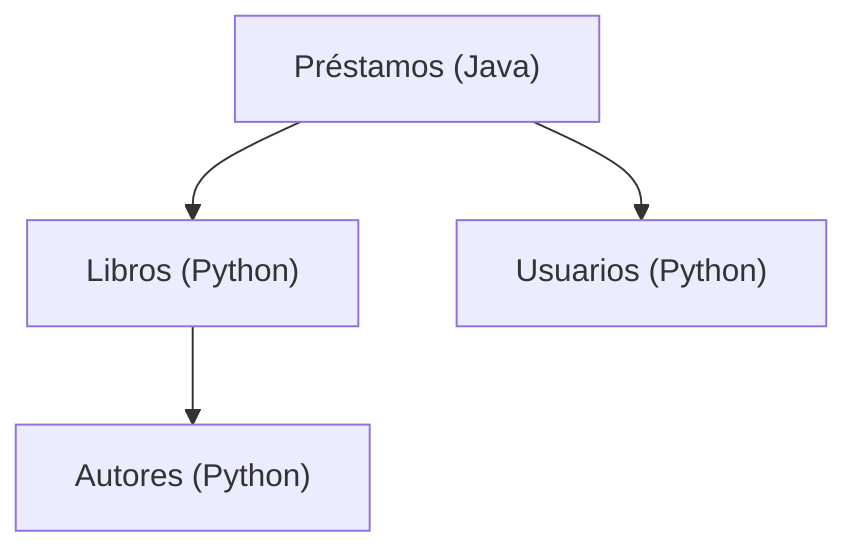

# Ejemplo de como presentar las tareas programadas

## Una biblioteca

```mermaid
flowchart TD
    A["Préstamos (Java)"]
    A-->B["Libros (Python)"]
    A-->c["Usuarios (Python)"]
    B-->D["Autores (Python)"]

```
